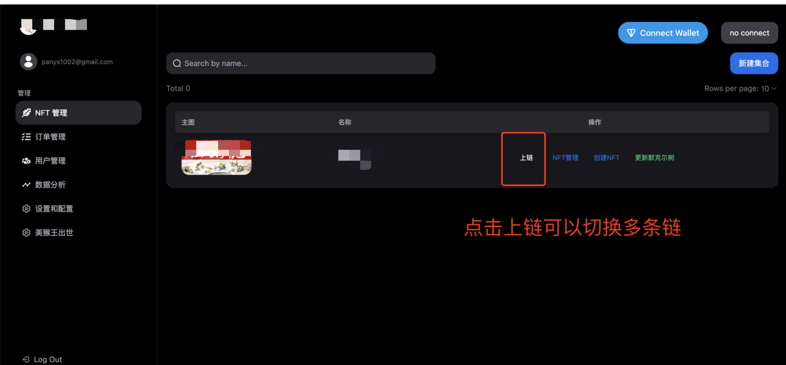
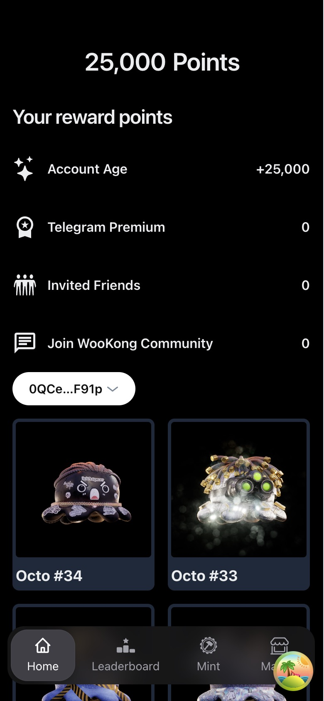
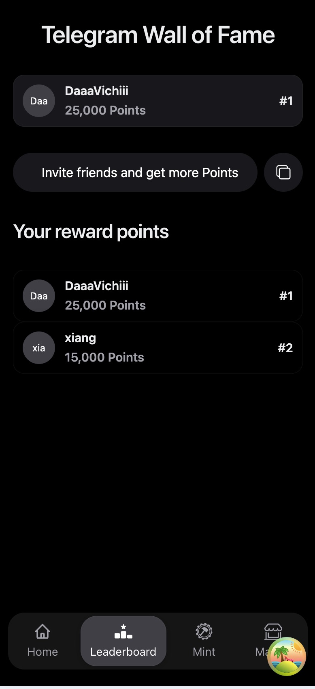
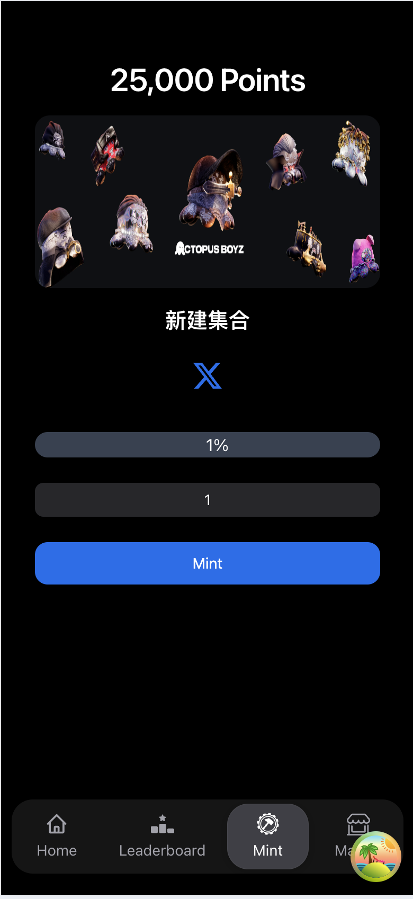
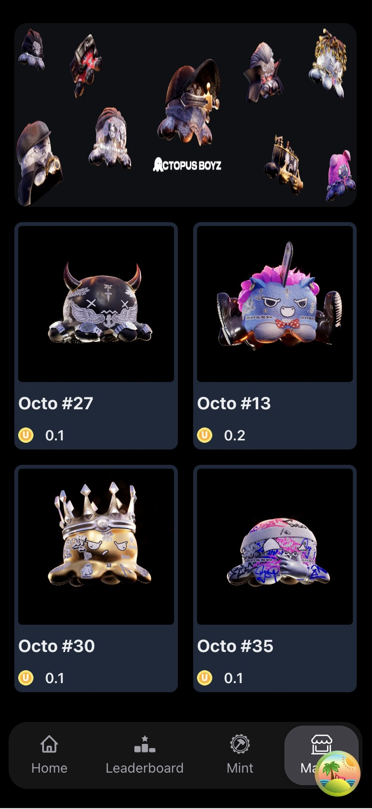
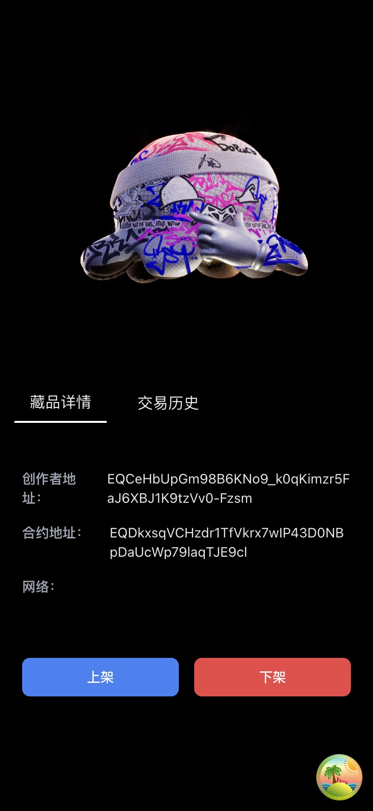
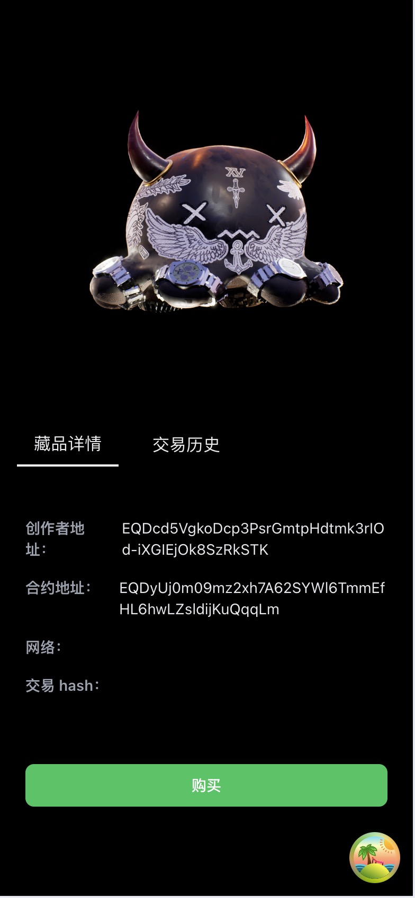
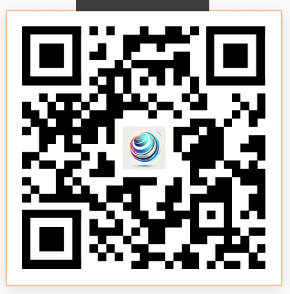

# MetaMint-Global 项目介绍

### 项目概述

MetaMint Global 是领先的全球化一键发布 NFT 平台，旨在通过多链网络轻松部署、管理和交易 NFT。我们的平台为用户提供了强大的工具，使创作者和收藏者能够在去中心化的数字资产世界中获得无与伦比的体验。

MetaMint Global 是一个支持多链网络的 NFT 一键发布平台，全球用户可以轻松铸造、管理和交易 NFT，为去中心化数字资产世界提供无与伦比的体验。

### 参与赛道
Innovative Dapps
 
xFi

### 核心功能

#### 一键发布NFT

#### Telegram 庞大用户量

####  用户排行

####  NFT 市场

### 代码仓库

https://github.com/panyongxu1002/MetaMint-Global

### 项目团队

Team Leader：[Peter Pan](https://github.com/panyongxu1002)
Solidity Contract： [BigBroFinch](https://github.com/BigBroFinch)  
Frond End： [xiangnuans](https://github.com/xiangnuans) 

### Deck 地址
[Deck](./全球化一键发布NFT平台.pptx)

### 项目演示

使用 tg 访问

